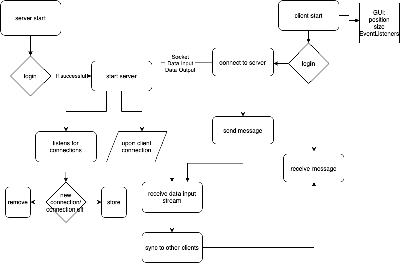
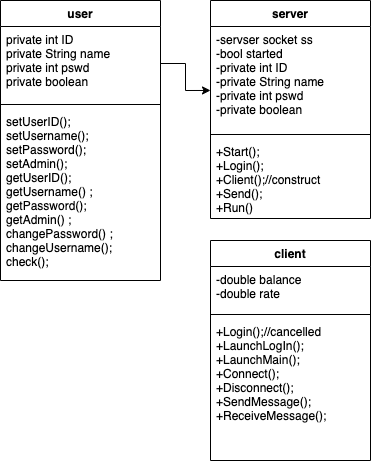

# Chat Room
The final project was originally intended to be a Sudoku Game Emulator; however, the project was cancelled as several classmates are doing highly similar projects. The author changed the project to be a simplified chatroom server and client app utilizing Java GUI, allowing user to login to a GUI based client, connect to a server, send messages, and sync messages across clients (which is why the author used GUI), etc.
Project Name: Java Chatroom
## Project Objective:
The program is to emulate a Java chatroom. It offers the feature of Java GUI, allowing user to login to a GUI based client, connect to a server, send messages, and sync messages across clients, etc.
The server uses Java network utilities to work, which allows connection from clients, listens for data input, forwarding the messages to different servers, and deal with multiple connect/disconnect situations that can easily cause bugs. The client on the other hand is a simple app that has a relative basic GUI, that can send messages to the server, receive messages and sync messages in the chat area with the help of the server. Both the server and the client is planned to have similar feature of user login, while a simple management tool is pending to be added to the server executively.
Intended Users:
 1. Anyone who would like to chat
 2. Secret massagers
 3. People or team who are looking for direction
 4. New programmers who are interested in learning the algorithm of some very common Java networking and Java GUI based on JFrame
 5. People who refer simple interface for chatting
   -	The project is trying to build a more thorough, bug-less platform for Java Chatroom, as networking has a lot of potential problems possible.
   -	The project is designed to run in Java through JFrame GUI, but server interface is planned to be offered in both GUI and CLI. File I/O (pending), Java networking, multi-thread design is planned to handle multiple clients as well.
   -	User case analysis: Below is a general and basic idea, which will be updated along the way.
        
## Data Design
Basic data design ideas (detailed included in UML):
Overall data design of course complies to OOP
Level, player and computer, as well as tutorial all takes a class
1. Server have:
 - Client restorer: currently Arraylist
2. Client have:
Basic struct
3. User have:
Basic struct
- Below is the data structure I came up with so far, still under continuous optimization. The setter and the getters are not included in this UML.
  
The introduction of user here is similar to the basic Idea of Bank on It

##	UI design
### CLI
Basic command line interface, mainly for sever login and debug status check
### GUI
Java JFrame, mainly for client

## Algorithm (by 04/23/2021)

```java
//class client
//init vars
// inherit is preferred for flex for the JFrame
// independent class
// or inherit right away
//window title location size background visibility
//display window
//login, add event listener
//client, add event listener
//func connect server
//init socket dis, dos
//error handle
//func disconnect server
//close socket dis, dos
//error handle
//send
//get input,
//push to server
//error handle
//receive
//get server dis
//put to the chat area
//error handle
//server
//init
//start server
//login
//init server socket

//ss accept connections
//add connected clients
//init client class upon connection
//init root user(super)
//construct client
//error handle
//start thread for client
//send
//receive
//error handle
//connection lost
/*These are the algorithm I came up with so far*/
/*Under continues optimization*/
```

•	OOP design
Initialized:
Access method:
The access method in this project is mainly about the User but less about server and clients. The data structure is mainly array list used to store connected clients in current stage of pre-development. More information in the data design section
Functions (so far):
```java
//Client:
Login();
Main(); //to run everything
LaunchLogIn();
LaunchMain();
Connect();
Disconnect();
SendMessage();
ReceiveMessage();

//Server:
Start();
Login();
SendClient();
Client();

//User:
        //Did not complete
setUserID();
setUsername();
setPassword();
setAdmin();

getUserID();
getUsername() ;
getPassword();
getAdmin() ;

changePassword() ;
changeUsername();
check();
```


	
